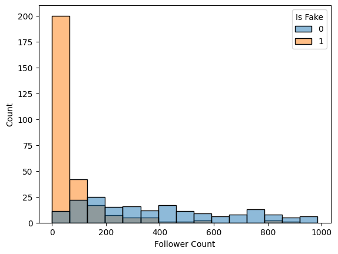

# Instagram Spam Detection: A Data-Driven Approach to Identify Fake Profiles

## Table of Contents
1. [Motivation](#motivation)
2. [Project Setup](#project-setup)
3. [Dataset](#dataset)
4. [Data Analysis](#data-analysis)
5. [Data Pipeline and Feature Engineering](#data-pipeline-and-feature-engineering)
6. [Machine Learning Model](#machine-learning-model)
7. [Model Evaluation and Final Results](#model-evaluation-and-final-results)
8. [License](#license)

## Motivation
This project is a binary classification problem aimed at distinguishing between genuine user accounts and spam or fake profiles. Detecting and eliminating fake profiles is crucial as it safeguards the platform's integrity, enhances user trust, and ensures a safer online environment for all users.

## Project Setup
To set up the project, create a virtual environment and activate it using the following commands:

```bash
python3 -m venv venv
source venv/bin/activate
```

Then, install the dependencies given in the `requirements.txt` file with:

```bash
pip install -r requirements.txt
```

## Dataset
The dataset used in this project is publicly available on [Kaggle](https://www.kaggle.com/datasets/free4ever1/instagram-fake-spammer-genuine-accounts) under the [Attribution 3.0 Unported](https://creativecommons.org/licenses/by/3.0/) license.

## Data Analysis
The dataset comprises various features, including follower/following count, description length, post count, the presence of an external URL, and the ratio of numerical characters to the total length of the username. After conducting permutation importance analysis using a quick and simple model, the results confirmed that follower count was the most influential feature, which is unsurprising. The figure below illustrates how a very low follower count serves as a strong indicator of a likely fake account.



Another insight gained is that, in the majority of cases, fake accounts tend to follow a significantly higher number of users compared to their follower count. The figure below displays a density plot of the follower/following ratio, confirming that a low ratio is a strong indicator of a likely fake account:


Additionally, many fake accounts exhibit a tendency to use a substantial number of numerals in their usernames, as validated by the plot below:


## Data Pipeline and Feature Engineering
The following decisions were made for the data pipeline and feature engineering:
1. Fullname/Username Num Ratio columns: **Feature engineering** was performed using **PCA** to create two new columns representing the axes with the highest variance.
2. Follower and Following columns: **Feature engineering** was applied to add a new column indicating the Follower/Following ratio.
3. Boolean features: **Feature engineering** included the generation of a cumulative count column per row.
4. Remaining features: These features were left unchanged and passed through the pipeline.

## Machine Learning Model
A **Pytorch** fully connected **neural network** was used with the following parameters:

| Parameter         | Value       |
|-------------------|-------------|
| n_layers          | 3           |
| n_units           | 64          |
| dropout_rate      | 0.2         |
| input_shape       | 7           |
| activation        | nn.ReLU()   |
| output_units      | 1           |
| output_activation | nn.Sigmoid()|

The loss function used was binary cross entropy and optimization was done using Adam optimizer with batch size 512 and early stopping.

## Model Evaluation and Final Results
After optimizing the hyperparameters, the best F1 score reached was 89%. The precision and recall tradeoff can be visualized as follows:


In this project, a decision was made to trade a bit of recall for a higher precision in order to be a bit more precise in identifying fake accounts, resulting in a recall of 84% and a precision of 94%.

## License
This project is under [CC0-1.0 license](https://creativecommons.org/publicdomain/zero/1.0/).
